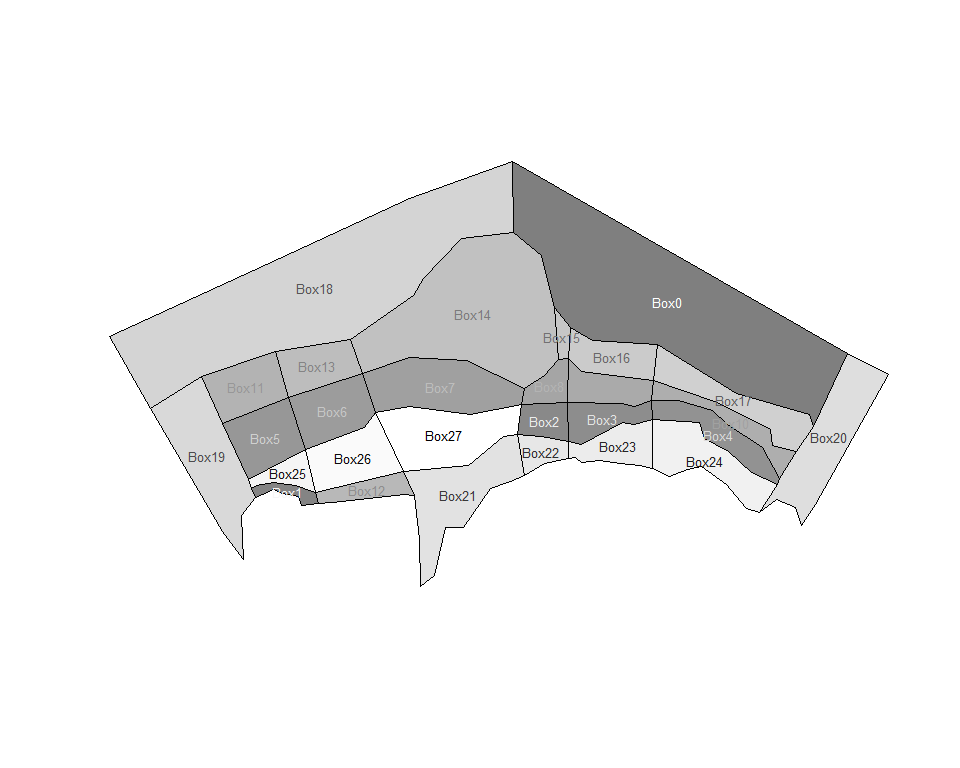
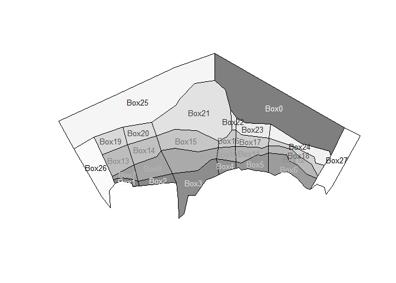

<!-- README.md is generated from README.Rmd. Please edit that file -->
[](https://travis-ci.org/mdsumner/rbgm) [](http://www.r-pkg.org/pkg/rbgm) [](http://www.r-pkg.org/pkg/rbgm)

rbgm - R tools for Box Geometry model files
-------------------------------------------

`rbgm` allows reading of geometry from BGM files, either in raw coordinate form or as Spatial objects.

Rbgm aims to make all of the following straightforward:

-   read of the BGM format, maintaining all topology and attributes
-   use of the BGM specification for visualization and data extraction
-   creation of BGM from from shapefiles, R spatial objects and whatever else

There is some overlapping functionality with [angstroms](https://github.com/mdsumner/angstroms), for coupling with ROMS output and with [gris](https://github.com/mdsumner/gris), for building topological data structures. All of these packages are in development and are subject to change.

Install dev version
-------------------

``` r
# install.packages("devtools")
devtools::install_github("mdsumner/rbgm")
```

Example
-------

Read in the built-in example .bgm file with `read_bgm`, and plot it as box-polygons.

``` r
library(rbgm)
#> Loading required package: raster
#> Loading required package: sp
library(scales)  ## for alpha function
## example data set in package
fname <- system.file("extdata", "Antarctica_28.bgm", package = "rbgm")
bgm <- read_bgm(fname)
plot(boxSpatial(bgm), col = grey(seq(0, 1, length = nrow(bgm$boxes))))
```

<!-- -->

The function `read_bgm` returns a generic list structure of tables, which currently includes the following. More on these later.

``` r
print(names(bgm))
#> [1] "vertices"         "facesXverts"      "faces"           
#> [4] "facesXboxes"      "boxesXverts"      "boxes"           
#> [7] "boundaryvertices" "extra"
```

There are two functions for converting from the raw .bgm data structures to `Spatial` objects, as defined in the `sp` package. (Spatial objects are formal GIS-like data that store a table of attribute data against a set of matching polygons, lines or points.)

-   `boxSpatial` converts to a `SpatialPolygonsDataFrame`, with a table of attributes relevant to the boxes
-   `faceSpatial` converts to a `SpatialLinesDataFram`, with attributes for the faces (straight line edges that define box boundaries)

From these conversions we can export to GIS formats like shapefiles.

It's important to note that the Spatial objects cannot store the full topological and attribute information present in the .bgm, so these are convenience converters that are one-way. We can generate .bgm from these objects, but it cannot be stored in just one Spatial object.

These converter functions provide fully-functional objects with complete coordinate system metadata, that we can subset, interrogate and plot.

``` r
(spdf <- boxSpatial(bgm))
#> class       : SpatialPolygonsDataFrame 
#> features    : 28 
#> extent      : -1991376, 1840092, -1049317, 1042354  (xmin, xmax, ymin, ymax)
#> coord. ref. : +proj=laea +lat_0=-63 +lon_0=82 +x_0=0 +y_0=0 +datum=WGS84 +units=m +no_defs +ellps=WGS84 +towgs84=0,0,0 
#> variables   : 10
#> names       : label, nconn,  botz,         area, vertmix, horizmix,    insideX,    insideY, .bx0, boundary 
#> min values  :  Box0,     3, -2120,  12850972822,   0e+00,        0, -1128926.5, -135019.93,    0,     TRUE 
#> max values  :  Box9,    13,  -499, 823802623354,   1e-05,        1,  1521521.9,  387882.74,   27,    FALSE

(sldf <- faceSpatial(bgm))
#> class       : SpatialLinesDataFrame 
#> features    : 90 
#> extent      : -1542253, 1469523, -685013.8, 696650.8  (xmin, xmax, ymin, ymax)
#> coord. ref. : +proj=laea +lat_0=-63 +lon_0=82 +x_0=0 +y_0=0 +datum=WGS84 +units=m +no_defs +ellps=WGS84 +towgs84=0,0,0 
#> variables   : 7
#> names       :       cosine,          sine, leftbox, rightbox,    length, .fx0, label 
#> min values  : -0.027850857, -0.0433564821,       0,        0,  28877.31,    0, face0 
#> max values  :  0.999999619,  0.9999999938,      27,       25, 456745.20,   89, face9
```

Subset based on attribute

``` r
subset(spdf, horizmix == 0, select = label)
#> class       : SpatialPolygonsDataFrame 
#> features    : 4 
#> extent      : -1991376, 1840092, -916229.8, 1042354  (xmin, xmax, ymin, ymax)
#> coord. ref. : +proj=laea +lat_0=-63 +lon_0=82 +x_0=0 +y_0=0 +datum=WGS84 +units=m +no_defs +ellps=WGS84 +towgs84=0,0,0 
#> variables   : 1
#> names       : label 
#> min values  :  Box0 
#> max values  : Box27

plot(boxSpatial(bgm), col = grey(seq(0, 1, length = nrow(bgm$boxes)), alpha = 0.5))

text(coordinates(spdf), labels = spdf$label, col = grey(seq(1, 0, length = nrow(bgm$boxes))), cex = 0.8)
```

<!-- -->

For illustration isolate boxes that are outside the boundary.

``` r

## subset the boundary boxes
plot(subset(spdf, boundary), border = "firebrick", lwd = 3)

## or just get a single boundary for the inner
plot(boundarySpatial(bgm), border = alpha("dodgerblue", 0.3), lwd = 7, add = TRUE)
```

<!-- -->

Plot the boxes and then label the faces.

``` r


plot(boxSpatial(bgm), col = grey(seq(0, 1, length = nrow(bgm$boxes)), alpha = 0.5))


plot(sldf, col = rainbow(nrow(sldf)), lwd = 2,  add = TRUE)
text(do.call(rbind, lapply(coordinates(sldf), function(x) apply(x[[1]], 2, mean))), 
     labels = gsub("ace", "", sldf$label), cex = 0.8, col = rainbow(nrow(sldf)), pos = 3)
```

<!-- -->

More information
----------------

The BGM format and usage is described at the (registration-required) Atlantis wiki: <http://atlantis.cmar.csiro.au/>
