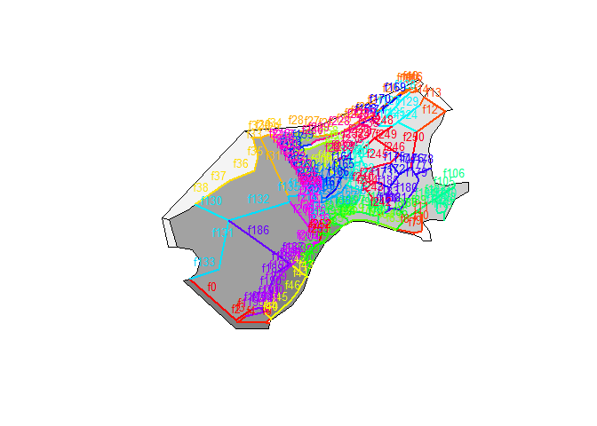
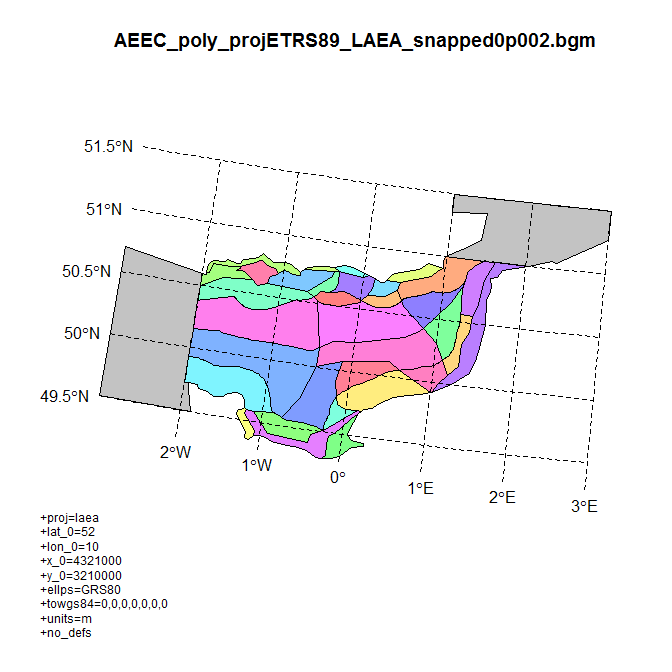
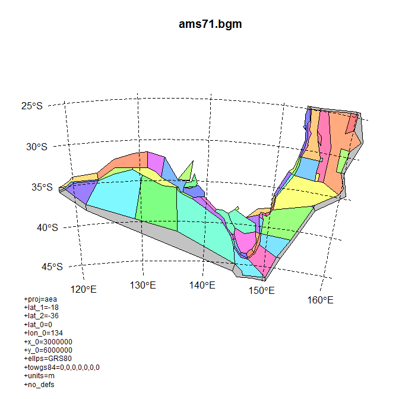
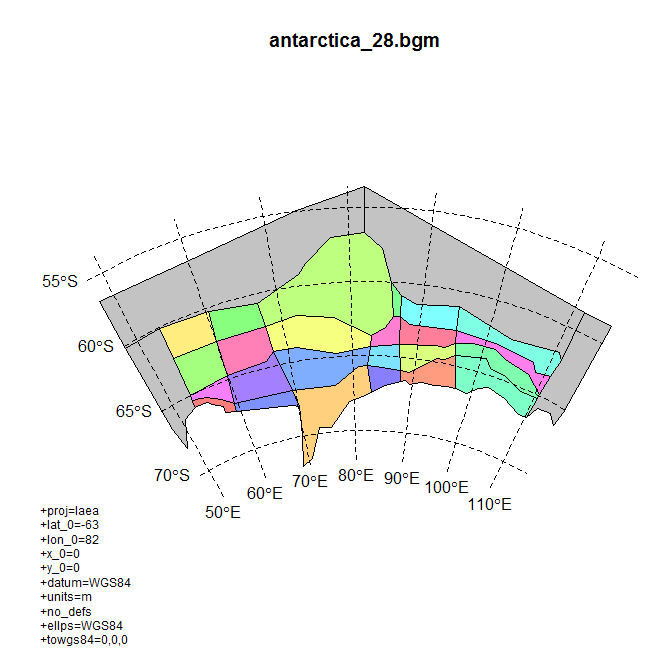
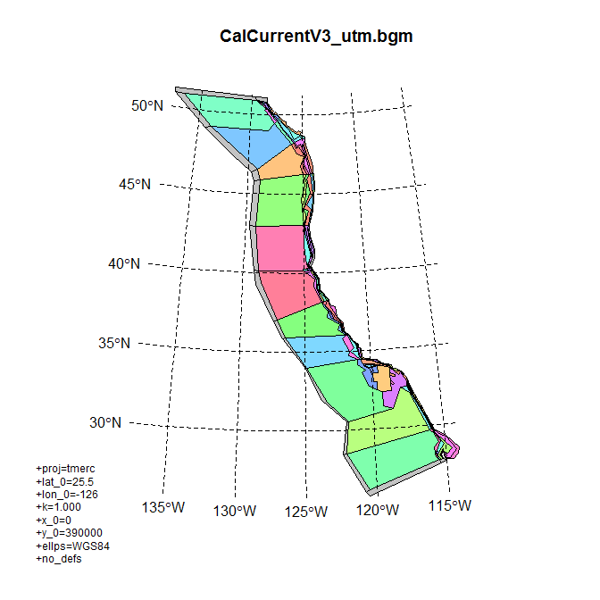
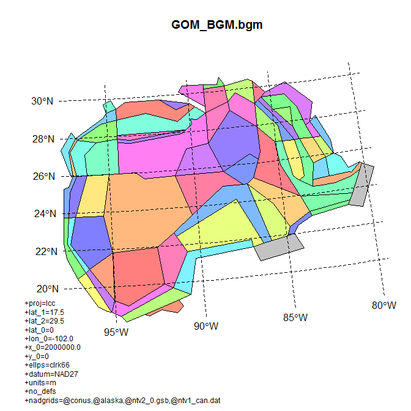
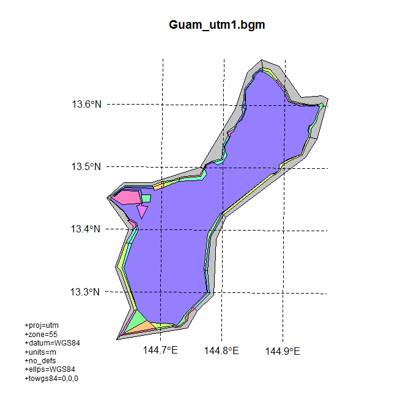
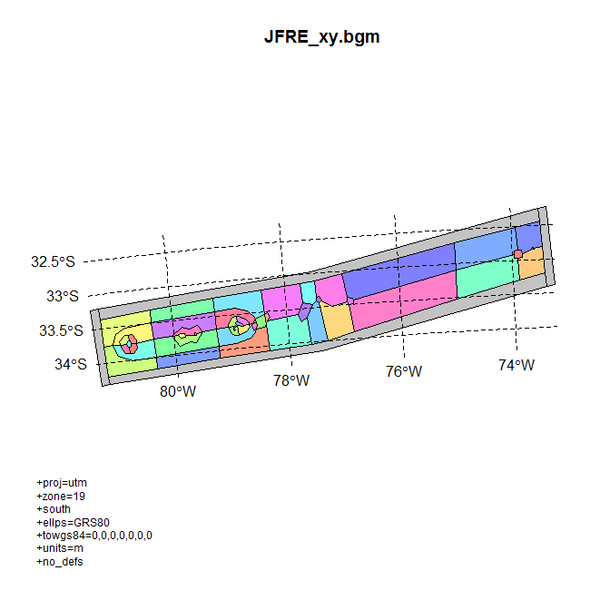
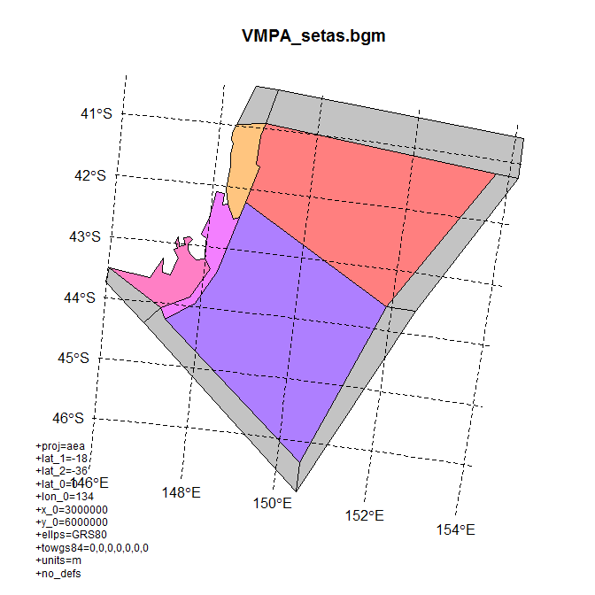

[](https://travis-ci.org/AustralianAntarcticDivision/rbgm) [](https://ci.appveyor.com/project/AustralianAntarcticDivision/rbgm) [](https://cran.r-project.org/package=rbgm) [](https://codecov.io/github/AustralianAntarcticDivision/rbgm?branch=master)

<!-- README.md is generated from README.Rmd. Please edit that file -->
rbgm - R tools for Box Geometry model files
-------------------------------------------

`rbgm` allows reading of geometry from BGM files, either in raw coordinate form or as Spatial objects.

Rbgm aims to make all of the following straightforward:

-   read of the BGM format, maintaining all topology and attributes
-   use of the BGM specification for visualization and data extraction
-   creation of BGM from from shapefiles, R spatial objects and whatever else

Installation
------------

Install from CRAN:

``` r
install.packages("rbgm")
```

Install the development version from Github using `devtools`.

``` r
# install.packages("devtools")
devtools::install_github("mdsumner/rbgm")
```

### How can I contribute to rbgm?

Install, use, test the package, and let me know!

Please use the Issues tab on GitHub to add feature requests and bug reports: <https://github.com/AustralianAntarcticDivision/rbgm/issues/>

use [Pull Requests](http://r-pkgs.had.co.nz/git.html#git-pullreq) if you have changes you'd like to contribute.

Related work
------------

-   [mfdbatlantis](https://github.com/mareframe/mfdbatlantis) MareFrame Atlantis routines
-   [atlantistools](https://github.com/alketh/atlantistools) data processing and visualisation tool for R
-   [shinyrAtlantis](https://github.com/shanearichards/shinyrAtlantis)
-   [ratlantis](https://github.com/jsgosnell/ratlantis) R code for interfacing with Atlantis ecosystem modeling software
-   [vat](https://github.com/mareframe/vat) Visualizing Atlantis Tool (vat)
-   [EastAntarctica\_Atlantis](https://github.com/AustralianAntarcticDivision/EastAntarctica_Atlantis) Project work at Australian Antarctic Division and the Antarctic Climate and Ecosystems CRC
-   [AtlantisNEUS\_R](https://github.com/erikjsolsen/AtlantisNEUS_R) R code (scripts and functions) to interact with and analyze output from the Atlantis NEAU End-2-end marine ecosystem model

Example
-------

Read in an example .bgm file with `bgmfile`, and plot it as box-polygons.

``` r
library(rbgm)
library(scales)  ## for alpha function
library(bgmfiles) ## example files
## example data set in package
fname <- sample(bgmfiles(), 1L)
bgm <- bgmfile(fname)
plot(boxSpatial(bgm), col = grey(seq(0, 1, length = nrow(bgm$boxes))))
```


The function `bgmfile` returns a generic list structure of tables, which currently includes the following. More on these later.

``` r
print(names(bgm))
#> [1] "vertices"         "facesXverts"      "faces"           
#> [4] "facesXboxes"      "boxesXverts"      "boxes"           
#> [7] "boundaryvertices" "extra"
```

There are functions for converting from the raw .bgm data structures to `Spatial` objects, as defined in the `sp` package. (Spatial objects are formal GIS-like data that store a table of attribute data against a set of matching polygons, lines or points.)

-   `boxSpatial` converts to a `SpatialPolygonsDataFrame`, with a table of attributes relevant to the boxes
-   `faceSpatial` converts to a `SpatialLinesDataFrame`, with attributes for the faces (straight line edges that define box boundaries)
-   `nodeSpatial` converts to a \`SpatialPointsDataFrame, with attributes for the unique vertices in the model
-   `pointSpatial` converts to a `SpatialPointsDataFrame`, with attributes for all instances of the vertices in the model (faces share vertices)
-   `boundarySpatial` converts just the boundary path to `SpatialPolygonsDataFrame`

From these conversions we can export to GIS formats like GeoPackage.

It's important to note that the Spatial objects cannot store the full topological and attribute information present in the .bgm, so these are convenience converters that are one-way. We can generate .bgm from these objects, but it cannot be stored in just one Spatial object.

These converter functions provide fully-functional objects with complete coordinate system metadata, that we can subset, interrogate and plot.

``` r
(spdf <- boxSpatial(bgm))
#> class       : SpatialPolygonsDataFrame 
#> features    : 11 
#> extent      : 3998613, 4730976, 805175.3, 1517099  (xmin, xmax, ymin, ymax)
#> coord. ref. : +proj=aea +lat_1=-18 +lat_2=-36 +lat_0=0 +lon_0=134 +x_0=3000000 +y_0=6000000 +ellps=GRS80 +towgs84=0,0,0,0,0,0,0 +units=m +no_defs 
#> variables   : 11
#> names       : label, nconn,  botz,        area, vertmix, horizmix, insideX,   insideY, .bx0, boundary, box_id 
#> min values  :  Box0,     1, -3405,  2920024932,   1e-06,        1, 4043668,  967318.3,    0,     TRUE,      0 
#> max values  :  Box9,     9,  -511, 85057277224,   1e-06,        1, 4603016, 1480676.5,   10,    FALSE,     10

(sldf <- faceSpatial(bgm))
#> class       : SpatialLinesDataFrame 
#> features    : 22 
#> extent      : 4005592, 4684173, 857210.3, 1451038  (xmin, xmax, ymin, ymax)
#> coord. ref. : +proj=aea +lat_1=-18 +lat_2=-36 +lat_0=0 +lon_0=134 +x_0=3000000 +y_0=6000000 +ellps=GRS80 +towgs84=0,0,0,0,0,0,0 +units=m +no_defs 
#> variables   : 7
#> names       :     cosine,       sine, left, right,     length, .fx0, label 
#> min values  : -0.3414389, 0.03452719,    1,     0,   5381.563,    0, face0 
#> max values  :  0.9994038, 0.98936601,   10,     9, 414601.134,   21, face9
```

Subset based on attribute

``` r
subset(spdf, horizmix == 0, select = label)
#> class       : SpatialPolygonsDataFrame 
#> features    : 0 
#> coord. ref. : +proj=aea +lat_1=-18 +lat_2=-36 +lat_0=0 +lon_0=134 +x_0=3000000 +y_0=6000000 +ellps=GRS80 +towgs84=0,0,0,0,0,0,0 +units=m +no_defs 
#> variables   : 1
#> names       : label

plot(boxSpatial(bgm), col = grey(seq(0, 1, length = nrow(bgm$boxes)), alpha = 0.5))

text(coordinates(spdf), labels = spdf$label, col = grey(seq(1, 0, length = nrow(bgm$boxes))), cex = 0.8)
```


For illustration isolate boxes that are outside the boundary.

``` r
## subset the boundary boxes
plot(subset(spdf, boundary), border = "firebrick", lwd = 3)

## or just get a single boundary for the inner
plot(boundarySpatial(bgm), border = alpha("dodgerblue", 0.3), lwd = 7, add = TRUE)
```


Plot the boxes and then label the faces.

``` r
plot(boxSpatial(bgm), col = grey(seq(0, 1, length = nrow(bgm$boxes)), alpha = 0.5))


plot(sldf, col = rainbow(nrow(sldf)), lwd = 2,  add = TRUE)
text(do.call(rbind, lapply(coordinates(sldf), function(x) apply(x[[1]], 2, mean))), 
     labels = gsub("ace", "", sldf$label), cex = 0.8, col = rainbow(nrow(sldf)), pos = 3)
```



Obtain the boundary polygon and plot.

``` r
plot(boundarySpatial(bgm), lwd = 4, col = "grey")
plot(boxSpatial(bgm), add = TRUE)
```


More information
----------------

The BGM format and usage is described at the (registration-required) Atlantis wiki: <http://atlantis.cmar.csiro.au/>

Extended examples
-----------------

Obtain every available BGM file and plot in native coordinates, with a graticule.

``` r
library(rbgm)
library(bgmfiles)

library(rgdal)
#> rgdal: version: 1.1-10, (SVN revision 622)
#>  Geospatial Data Abstraction Library extensions to R successfully loaded
#>  Loaded GDAL runtime: GDAL 2.0.1, released 2015/09/15
#>  Path to GDAL shared files: C:/inst/R/R/library/rgdal/gdal
#>  Loaded PROJ.4 runtime: Rel. 4.9.2, 08 September 2015, [PJ_VERSION: 492]
#>  Path to PROJ.4 shared files: C:/inst/R/R/library/rgdal/proj
#>  Linking to sp version: 1.2-3

## turn +proj into line separated text
breakproj <- function(x) {
  paste(strsplit(x, " ")[[1]], collapse = "\n")
}
files <- bgmfiles()
for (i in seq_along(files)) {
  bgm <- bgmfile(files[i])
  boxes <- boxSpatial(bgm)
  plot(boxes, col = ifelse(boxes$boundary, "#88888880", sample(rainbow(nrow(boxes), alpha = 0.5))))
  op <- par(xpd = NA)
  llgridlines(boxes)
  par(op)
  title(basename(files[i]), cex = 0.8)
  mtext(breakproj(proj4string(boxes)), cex = 0.75, side = 2, las = 1, adj = 0, line = 2, at = par("usr")[3], xpd = NA)
 
}
```



    #> C:/inst/R/R/library/bgmfiles/extdata/bgm/ams71.bgm 
    #> file declares 187 faces but contains data for 193 faces
    #> 
    #>  ... returning all 193 faces


