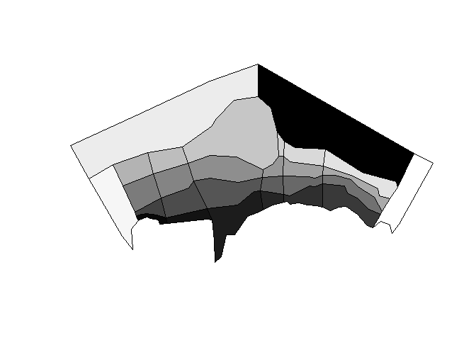
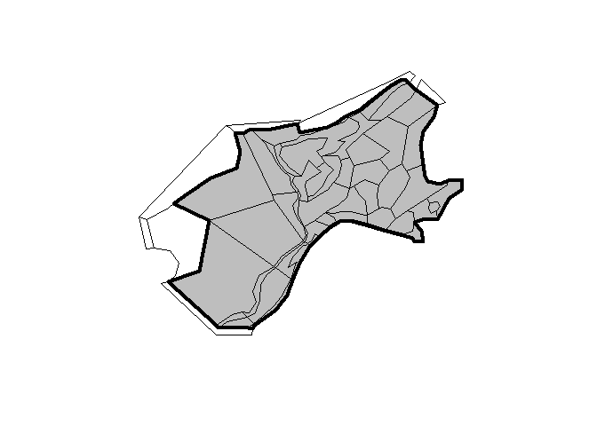
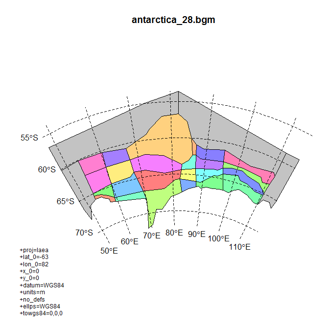
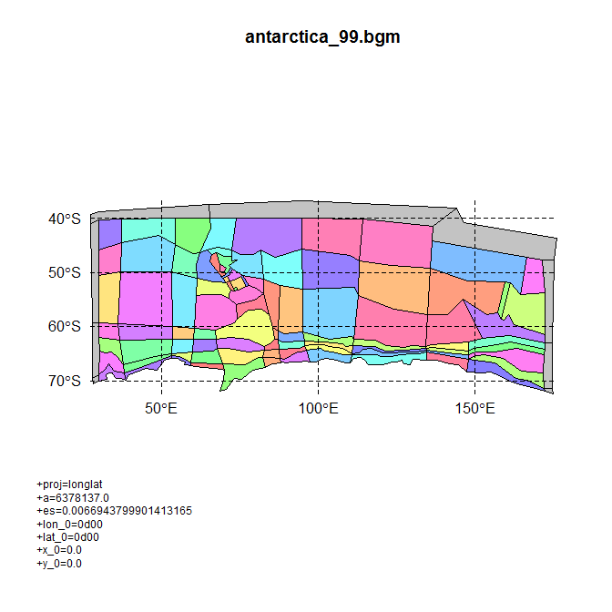
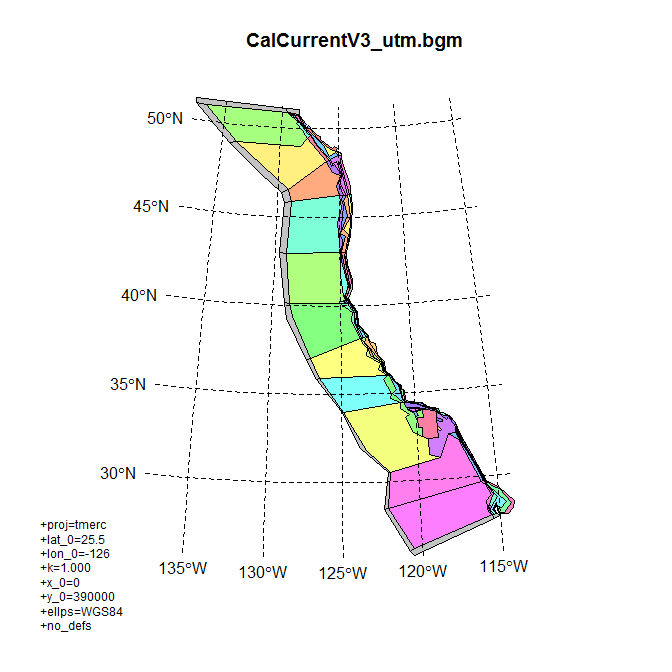
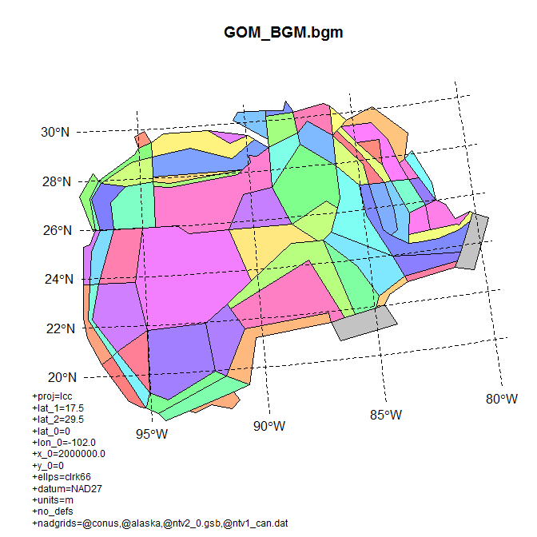
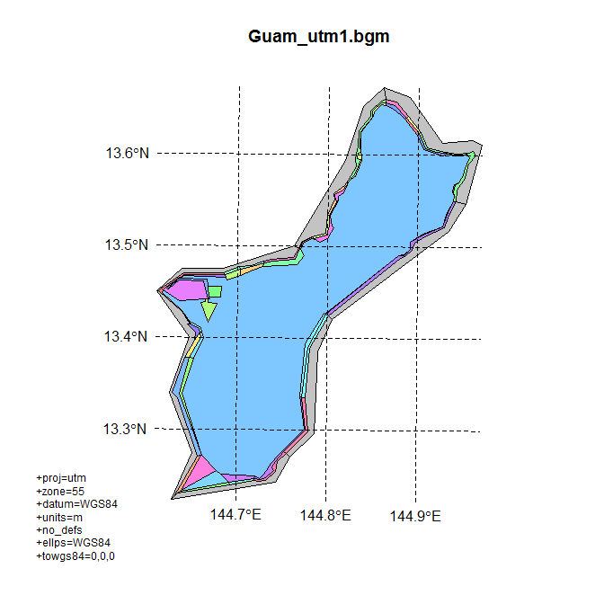

[](https://travis-ci.org/mdsumner/rbgm)

<!-- README.md is generated from README.Rmd. Please edit that file -->
rbgm - R tools for Box Geometry model files
-------------------------------------------

`rbgm` allows reading of geometry from BGM files, either in raw coordinate form or as Spatial objects.

Rbgm aims to make all of the following straightforward:

-   read of the BGM format, maintaining all topology and attributes
-   use of the BGM specification for visualization and data extraction
-   creation of BGM from from shapefiles, R spatial objects and whatever else

There is some overlapping functionality with [angstroms](https://github.com/mdsumner/angstroms), for coupling with ROMS output and with [gris](https://github.com/mdsumner/gris), for building topological data structures, and [spbabel](https://github.com/mdsumner/babel) for interfacing Spatial with ggplot2, dplyr and other database-based tools. *All of these packages are in development and are subject to change, please let me know if you are interested and/or I can help with their use.*

Installation
------------

Install from Github using `devtools`.

``` r
# install.packages("devtools")
devtools::install_github("mdsumner/rbgm")
```

Development
-----------

To obtain the development version of `rbgm` use the following steps in RStudio.

1.  Install packages `install.packages("devtools", "roxygen2", "knitr", "htmltools")`.
2.  Create a New Project in RStudio, select Version Control, and then Git. [See here to get Git](https://support.rstudio.com/hc/en-us/articles/200532077?version=0.99.892&mode=desktop)
3.  Enter "<https://github.com/mdsumner/rbgm.git>".
4.  Run this to install all required dependencies for building and testing: `devtools::install_deps(dependencies = TRUE)`
5.  Go to Tools/Options/Project Options ... and under Build Tools select "Generate documentation with roxygen", click on all options.
6.  Ctrl-SHIFT-B to build the package and reload.
7.  Ctrl-SHIFT-T to run the tests.
8.  Ctrl-SHIFT-E to run R CMD check.

### How can I contribute to rbgm?

Install, use, test the package, and let me know!

Please use the Issues tab on GitHub to add feature requests and bug reports.

use [Pull Requests](http://r-pkgs.had.co.nz/git.html#git-pullreq) if you have changes you'd like to contribute.

Related work
------------

-   [mfdbatlantis](https://github.com/mareframe/mfdbatlantis) MareFrame Atlantis routines
-   [atlantistools](https://github.com/alketh/atlantistools) data processing and visualisation tool for R
-   [shinyrAtlantis](https://github.com/shanearichards/shinyrAtlantis)
-   [ratlantis](https://github.com/jsgosnell/ratlantis) R code for interfacing with Atlantis ecosystem modeling software
-   [vat](https://github.com/mareframe/vat) Visualizing Atlantis Tool (vat)
-   [EastAntarctica\_Atlantis](https://github.com/AustralianAntarcticDivision/EastAntarctica_Atlantis) Project work at Australian Antarctic Division and the Antarctic Climate and Ecosystems CRC
-   [AtlantisNEUS\_R](https://github.com/erikjsolsen/AtlantisNEUS_R) R code (scripts and functions) to interact with and analyze output from the Atlantis NEAU End-2-end marine ecosystem model

Example
-------

Read in the built-in example .bgm file with `bgmfile`, and plot it as box-polygons.

``` r
library(rbgm)
library(scales)  ## for alpha function
## example data set in package
fname <- system.file("extdata", "Antarctica_28.bgm", package = "rbgm")
bgm <- bgmfile(fname)
plot(boxSpatial(bgm), col = grey(seq(0, 1, length = nrow(bgm$boxes))))
```

<!-- -->

The function `bgmfile` returns a generic list structure of tables, which currently includes the following. More on these later.

``` r
print(names(bgm))
#> [1] "vertices"         "facesXverts"      "faces"           
#> [4] "facesXboxes"      "boxesXverts"      "boxes"           
#> [7] "boundaryvertices" "extra"
```

There are two functions for converting from the raw .bgm data structures to `Spatial` objects, as defined in the `sp` package. (Spatial objects are formal GIS-like data that store a table of attribute data against a set of matching polygons, lines or points.)

-   `boxSpatial` converts to a `SpatialPolygonsDataFrame`, with a table of attributes relevant to the boxes
-   `faceSpatial` converts to a `SpatialLinesDataFram`, with attributes for the faces (straight line edges that define box boundaries)

From these conversions we can export to GIS formats like shapefiles.

It's important to note that the Spatial objects cannot store the full topological and attribute information present in the .bgm, so these are convenience converters that are one-way. We can generate .bgm from these objects, but it cannot be stored in just one Spatial object.

These converter functions provide fully-functional objects with complete coordinate system metadata, that we can subset, interrogate and plot.

``` r
(spdf <- boxSpatial(bgm))
#> class       : SpatialPolygonsDataFrame 
#> features    : 28 
#> extent      : -1991376, 1840092, -1049317, 1042354  (xmin, xmax, ymin, ymax)
#> coord. ref. : +proj=laea +lat_0=-63 +lon_0=82 +x_0=0 +y_0=0 +datum=WGS84 +units=m +no_defs +ellps=WGS84 
#> variables   : 10
#> names       : label, nconn,  botz,         area, vertmix, horizmix,    insideX,    insideY, .bx0, boundary 
#> min values  :  Box0,     3, -2120,  12850972822,   0e+00,        0, -1128926.5, -135019.93,    0,     TRUE 
#> max values  :  Box9,    13,  -499, 823802623354,   1e-05,        1,  1521521.9,  387882.74,   27,    FALSE

(sldf <- faceSpatial(bgm))
#> class       : SpatialLinesDataFrame 
#> features    : 90 
#> extent      : -1542253, 1469523, -685013.8, 696650.8  (xmin, xmax, ymin, ymax)
#> coord. ref. : +proj=laea +lat_0=-63 +lon_0=82 +x_0=0 +y_0=0 +datum=WGS84 +units=m +no_defs +ellps=WGS84 
#> variables   : 7
#> names       :       cosine,          sine, leftbox, rightbox,    length, .fx0, label 
#> min values  : -0.027850857, -0.0433564821,       0,        0,  28877.31,    0, face0 
#> max values  :  0.999999619,  0.9999999938,      27,       25, 456745.20,   89, face9
```

Subset based on attribute

``` r
subset(spdf, horizmix == 0, select = label)
#> class       : SpatialPolygonsDataFrame 
#> features    : 4 
#> extent      : -1991376, 1840092, -916229.8, 1042354  (xmin, xmax, ymin, ymax)
#> coord. ref. : +proj=laea +lat_0=-63 +lon_0=82 +x_0=0 +y_0=0 +datum=WGS84 +units=m +no_defs +ellps=WGS84 
#> variables   : 1
#> names       : label 
#> min values  :  Box0 
#> max values  : Box27

plot(boxSpatial(bgm), col = grey(seq(0, 1, length = nrow(bgm$boxes)), alpha = 0.5))

text(coordinates(spdf), labels = spdf$label, col = grey(seq(1, 0, length = nrow(bgm$boxes))), cex = 0.8)
```

<!-- -->

For illustration isolate boxes that are outside the boundary.

``` r
## subset the boundary boxes
plot(subset(spdf, boundary), border = "firebrick", lwd = 3)

## or just get a single boundary for the inner
plot(boundarySpatial(bgm), border = alpha("dodgerblue", 0.3), lwd = 7, add = TRUE)
```

<!-- -->

Plot the boxes and then label the faces.

``` r
plot(boxSpatial(bgm), col = grey(seq(0, 1, length = nrow(bgm$boxes)), alpha = 0.5))


plot(sldf, col = rainbow(nrow(sldf)), lwd = 2,  add = TRUE)
text(do.call(rbind, lapply(coordinates(sldf), function(x) apply(x[[1]], 2, mean))), 
     labels = gsub("ace", "", sldf$label), cex = 0.8, col = rainbow(nrow(sldf)), pos = 3)
```

<!-- -->

Obtain the boundary polygon and plot.

``` r
plot(boundarySpatial(bgm), lwd = 4, col = "grey")
plot(boxSpatial(bgm), add = TRUE)
```

<!-- -->

More information
----------------

The BGM format and usage is described at the (registration-required) Atlantis wiki: <http://atlantis.cmar.csiro.au/>

Extended examples
-----------------

Obtain every available BGM file and plot in native coordinates, with a graticule.

``` r
library(rbgm)
library(bgmfiles)

library(rgdal)
#> rgdal: version: 1.1-8, (SVN revision 616)
#>  Geospatial Data Abstraction Library extensions to R successfully loaded
#>  Loaded GDAL runtime: GDAL 2.0.1, released 2015/09/15
#>  Path to GDAL shared files: E:/inst/R/R/library/rgdal/gdal
#>  GDAL does not use iconv for recoding strings.
#>  Loaded PROJ.4 runtime: Rel. 4.9.1, 04 March 2015, [PJ_VERSION: 491]
#>  Path to PROJ.4 shared files: E:/inst/R/R/library/rgdal/proj
#>  Linking to sp version: 1.2-2

## turn +proj into line separated text
breakproj <- function(x) {
  paste(strsplit(x, " ")[[1]], collapse = "\n")
}
files <- bgmfiles()
for (i in seq_along(files)) {
  bgm <- bgmfile(files[i])
  boxes <- boxSpatial(bgm)
  plot(boxes, col = ifelse(boxes$boundary, "#88888880", sample(rainbow(nrow(boxes), alpha = 0.5))))
  op <- par(xpd = NA)
  llgridlines(boxes)
  par(op)
  title(basename(files[i]), cex = 0.8)
  mtext(breakproj(proj4string(boxes)), cex = 0.75, side = 2, las = 1, adj = 0, line = 2, at = par("usr")[3], xpd = NA)
 
}
```

<!-- --><!-- --><!-- --><!-- --><!-- --><!-- --><!-- -->

Make a single map of every BGM.

``` r
library(mapview)
#> Loading required package: leaflet
m <- mapView()
library(maptools);data(wrld_simpl);plot(wrld_simpl)
#> Checking rgeos availability: TRUE
 centroids <- matrix(NA_real_, nrow = length(files), ncol = 2)

for (i in seq_along(files)) {
  bgm <- bgmfile(files[i])
  boxes <- boxSpatial(bgm)
  bll <- if (isLonLat(boxes)) boxes else spTransform(boxes, "+proj=longlat +ellps=WGS84")
  m <- m + mapView(bll,  color = ifelse(boxes$boundary, "#88888880", sample(rainbow(nrow(boxes), alpha = 0.5))),  layer.name = basename(files[i]))
  plot(bll, add = TRUE)
 

   centroids[i, ] <- coordinates(rgeos::gCentroid(bll))
}
points(centroids, col = "red", pch = 19)
```

<!-- -->

``` r
m 
```

Convert each to XYZ on the globe and plot.

``` r
#devtools::install_github("mdsumner/gris", ref = "cran-sprint")
library(gris)
for (i in seq_along(files)) {
  bgm <- bgmfile(files[i])
  boxes <- boxSpatial(bgm)
  bll <- if (isLonLat(boxes)) boxes else spTransform(boxes, "+proj=longlat +ellps=WGS84")
 g <- gris(bll)
 gt <- triangulate(g)
 plot3d(gt, add = i > 1)
}

plot3d(triangulate(gris(wrld_simpl)), add = TRUE, col = "black")
rgl::light3d(specular = "aliceblue", viewpoint.rel = FALSE)
rgl::bg3d("black")
```
