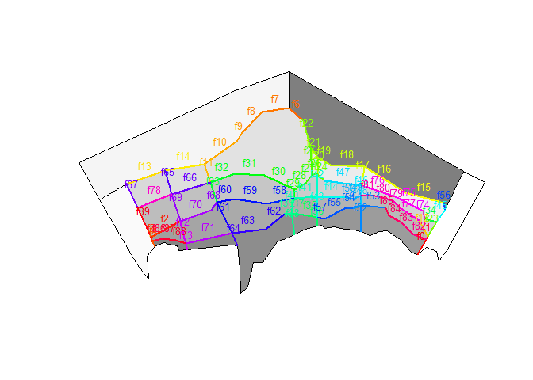

<!-- README.md is generated from README.Rmd. Please edit that file -->
[](https://travis-ci.org/mdsumner/rbgm) [](http://www.r-pkg.org/pkg/rbgm) [](http://www.r-pkg.org/pkg/rbgm)

rbgm - R tools for Box Geometry model files
-------------------------------------------

rbgm allows reading of geometry from BGM files, either in raw coordinate form or as Spatial objects.

rbgm aims to make all of this straightforward:

-   read of the BGM format, maintaining all topology and attributes
-   use of the BGM specification for visualization and data extraction
-   creation of BGM from from shapefiles, R spatial objects and whatever else

There is some overlapping functionality with [oms](https://github.com/mdsumner/oms), for coupling with ROMS output and with [gris](https://github.com/mdsumner/gris), for building topological data structures. All of these packages are in development and are subject to change.

Install dev version
-------------------

``` r
# install.packages("devtools")
devtools::install_github("mdsumner/rbgm")
```

Example
-------

``` r
library(rbgm)
#> Loading required package: raster
#> Loading required package: sp
## example data set in package
fname <- system.file("extdata", "Antarctica_28.bgm", package = "rbgm")
bgm <- read_bgm(fname)
plot(boxSpatial(bgm), col = grey(seq(0, 1, length = nrow(bgm$boxes)), alpha = 0.5))

(spdf <- boxSpatial(bgm))
#> class       : SpatialPolygonsDataFrame 
#> features    : 28 
#> extent      : -1991376, 1840092, -1049317, 1042354  (xmin, xmax, ymin, ymax)
#> coord. ref. : +proj=laea +lat_0=-63 +lon_0=82 +x_0=0 +y_0=0 +datum=WGS84 +units=m +no_defs +ellps=WGS84 +towgs84=0,0,0 
#> variables   : 9
#> names       : label, nconn,  botz,         area, vertmix, horizmix,    insideX,    insideY, .bx0 
#> min values  :  Box0,     3, -2120,  12850972822,   0e+00,        0, -1128926.5, -135019.93,    0 
#> max values  :  Box9,    13,  -499, 823802623354,   1e-05,        1,  1521521.9,  387882.74,   27
(sldf <- faceSpatial(bgm))
#> class       : SpatialLinesDataFrame 
#> features    : 90 
#> extent      : -1542253, 1469523, -685013.8, 696650.8  (xmin, xmax, ymin, ymax)
#> coord. ref. : +proj=laea +lat_0=-63 +lon_0=82 +x_0=0 +y_0=0 +datum=WGS84 +units=m +no_defs +ellps=WGS84 +towgs84=0,0,0 
#> variables   : 7
#> names       :       cosine,          sine, leftbox, rightbox,    length, .fx0, label 
#> min values  : -0.027850857, -0.0433564821,       0,        0,  28877.31,    0, face0 
#> max values  :  0.999999619,  0.9999999938,      27,       25, 456745.20,   89, face9
text(coordinates(spdf), labels = spdf$label, col = grey(seq(1, 0, length = nrow(bgm$boxes))), cex = 0.8)
```

<!-- -->

``` r

plot(boxSpatial(bgm), col = grey(seq(0, 1, length = nrow(bgm$boxes)), alpha = 0.5))

plot(sldf, col = rainbow(nrow(sldf)), lwd = 2,  add = TRUE)
text(do.call(rbind, lapply(coordinates(sldf), function(x) apply(x[[1]], 2, mean))), 
     labels = gsub("ace", "", sldf$label), cex = 0.8, col = rainbow(nrow(sldf)), pos = 3)
```

<!-- -->

More information
----------------

The BGM format and usage is described at the (registration-required) Atlantis wiki: <http://atlantis.cmar.csiro.au/>

Questions
---------

-   polygon maps may have lines requiring denser sets of vertices (say for lines of constant latitude), this can be an issue for ROMS where all lookup is done in long-lat (the coupler should sort this out IMO, not BGM)
-
